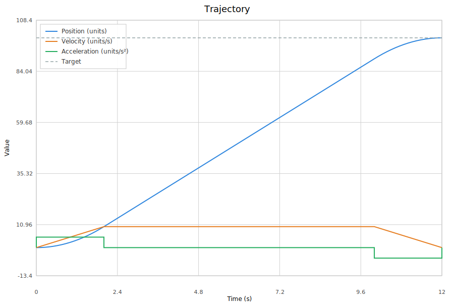

# Chapter 5: Trapezoidal & Exponential Profiles

Motion profiles transform an instantaneous setpoint change into a physically achievable trajectory. Instead of commanding the motor to jump from 0 to 1000 TPS in one cycle, a profile ramps the setpoint through an acceleration phase, a cruise phase, and a deceleration phase. This chapter covers the two profile types in WpiMath: `TrapezoidProfile` for constant-acceleration motion and `ExponentialProfile` for first-order system response.

## 5.1 Why Profiles Matter

Without a profile, a setpoint change produces a step error. The PID controller reacts with maximum output, slamming the motor to full power. The mechanism accelerates as fast as physics allows, overshoots the target, and oscillates. The derivative term damps the oscillation, but the damage is already done — the mechanism has been stressed, the current draw has spiked, and the settling time is longer than necessary.

A motion profile eliminates this problem by generating a setpoint trajectory that respects the mechanism's physical limits. The controller never sees a large error because the setpoint moves gradually. The result is:

- **Reduced mechanical stress** — acceleration is bounded (jerk bounding requires S-curve profiles, covered in Chapter 6)
- **Predictable timing** — the profile computes exactly how long the move will take
- **No overshoot in the profile itself** — the setpoint decelerates to a stop at the target (the physical mechanism won't overshoot if the controller tracks the profile well)
- **Optimal speed** — the mechanism runs at maximum safe velocity during cruise

## 5.2 The Trapezoidal Velocity Profile

The trapezoidal profile is named for the shape of its velocity curve. When plotted against time, the velocity forms a trapezoid: a linear ramp up (acceleration), a flat top (cruise at max velocity), and a linear ramp down (deceleration).



The profile is defined by two constraints:

```java
var constraints = new TrapezoidProfile.Constraints(maxVelocity, maxAcceleration);
```

- **maxVelocity** — the maximum speed the mechanism can safely achieve
- **maxAcceleration** — the maximum acceleration that does not cause wheel slip, structural flex, or back-EMF violation

### The Three Phases

Given a distance to travel, the profile computes three phases:

**Phase 1: Acceleration** — Velocity increases linearly from the initial velocity to `maxVelocity` (or to the peak velocity if the distance is too short to reach `maxVelocity`). The duration is `maxVelocity / maxAcceleration`.

**Phase 2: Cruise** — Velocity is held constant at `maxVelocity`. The duration depends on the total distance minus the acceleration and deceleration distances.

**Phase 3: Deceleration** — Velocity decreases linearly from `maxVelocity` to the goal velocity (usually zero). The duration equals the acceleration duration when starting and ending at rest; otherwise, the two durations may differ.

The position during each phase is computed by integrating the velocity:

- **Acceleration**: $p(t) = p_0 + v_0 t + \tfrac{1}{2} a t^2$
- **Cruise**: $`p(t) = p_{\text{accel\_end}} + v_{\max}(t - t_{\text{accel}})`$
- **Deceleration**: $`p(t) = p_{\text{goal}} - v_{\text{goal}}(t_{\text{end}} - t) - \tfrac{1}{2} a (t_{\text{end}} - t)^2`$

The deceleration phase is computed **backward from the goal**, ensuring the profile arrives at the exact target position with zero velocity.

### The Triangular Case

When the distance is too short to reach `maxVelocity`, the profile becomes triangular — it accelerates for half the distance and immediately decelerates for the other half. The peak velocity is:

$$v_{\text{peak}} = \sqrt{d \cdot a_{\max}}$$

Note that `d` here is the equivalent full-trapezoid distance (which includes corrections for nonzero initial/final velocities), not the raw displacement. The profile detects the triangular case automatically. If the computed "full speed distance" is negative, there is no cruise phase, and the acceleration time is recalculated:

```java
if (fullSpeedDist < 0) {
    accelerationTime = Math.sqrt(fullTrapezoidDist / maxAcceleration);
}
```

### State and Constraints

The profile operates on `State` objects containing position and velocity:

```java
public static class State {
    public final double position;
    public final double velocity;
}
```

The `calculate(t, current, goal)` method returns the state at time `t` along the trajectory from `current` to `goal`:

```java
TrapezoidProfile profile = new TrapezoidProfile(constraints);
TrapezoidProfile.State current = new TrapezoidProfile.State(0, 0);
TrapezoidProfile.State goal = new TrapezoidProfile.State(100, 0);

TrapezoidProfile.State state = profile.calculate(0.5, current, goal);
// state.position = 12.5, state.velocity = 50.0 (after 0.5s of acceleration)
```

### Total Time

The profile computes the total duration of the move:

```java
double totalTime = profile.totalTime();
```

This is the sum of acceleration time, cruise time, and deceleration time. It is useful for determining whether a move can complete before a deadline.

### Non-Zero Initial and Final Velocities

The profile handles non-zero initial and final velocities. This is essential for mid-motion replanning: if the mechanism is already moving when a new target is commanded, the profile starts from the current velocity, not from rest.

The profile also handles **velocity clamping**: if the current velocity exceeds `maxVelocity`, it is clamped to `maxVelocity` (preserving the sign) and the profile calculates from there. Whether it decelerates depends on the goal — the clamping does not force immediate deceleration.

### Direction Handling

The profile detects direction automatically. If `goal.position < current.position`, the profile runs in reverse — acceleration is negative and deceleration is positive. All internal calculations use the absolute distance and flip the sign at the end.

## 5.3 Using TrapezoidProfile Directly

The simplest usage pattern is to call `calculate()` each cycle with an accumulating time:

```java
TrapezoidProfile profile = new TrapezoidProfile(
    new TrapezoidProfile.Constraints(100, 50));  // 100 units/s, 50 units/s^2

TrapezoidProfile.State current = new TrapezoidProfile.State(0, 0);
TrapezoidProfile.State goal = new TrapezoidProfile.State(100, 0);

double t = 0;
while (!profile.isFinished(t)) {
    TrapezoidProfile.State state = profile.calculate(t, current, goal);
    motor.setPower(state.velocity / maxVelocity);  // open-loop only — no feedback
    t += 0.02;  // 50 Hz loop
}
```

In practice, you rarely use `TrapezoidProfile` directly. Instead, you use it through `ProfiledPIDController`, which integrates the profile with PID feedback.

## 5.4 ProfiledPIDController

`ProfiledPIDController` wraps a `PIDController` and a `TrapezoidProfile`. Each call to `calculate()` advances the profile by one period and returns the PID output for the profiled setpoint:

```java
ProfiledPIDController pid = new ProfiledPIDController(
    0.1, 0, 0.01,  // kP, kI, kD
    new TrapezoidProfile.Constraints(100, 50));

pid.setGoal(100);  // target position

// Each cycle:
double output = pid.calculate(currentPosition);
motor.setPower(output);
```

Internally, this does two things:

```java
// 1. Advance the profiled setpoint
m_setpoint = m_profile.calculate(getPeriod(), m_setpoint, m_goal);

// 2. PID tracks the profiled setpoint position (velocity is not used as feedforward)
return m_controller.calculate(measurement, m_setpoint.position);
```

The PID controller sees the error between the measurement and the **profiled setpoint**, not the raw goal. Since the setpoint moves gradually, the error stays small and the output stays smooth.

### Resetting the Profile

When the controller is first enabled, the setpoint starts at zero position and zero velocity. If the mechanism is already at position 50, the initial error is 50 and the output spikes. Call `reset()` to seed the setpoint:

```java
pid.reset(currentPosition, currentVelocity);
pid.setGoal(100);
```

This sets the profiled setpoint to the current state, so the initial error is zero. The profile then ramps from the current state to the goal.

### Changing the Goal Mid-Motion

You can change the goal at any time, even while the profile is running:

```java
pid.setGoal(100);
// ... some cycles later ...
pid.setGoal(150);  // extends the move
```

The profile recalculates from the current setpoint to the new goal. The transition is smooth because the setpoint's current position and velocity are used as the initial conditions for the new profile.

### Continuous Input

For rotational mechanisms, enable continuous input to ensure the profile takes the shortest path:

```java
pid.enableContinuousInput(0, 2 * Math.PI);
pid.setGoal(Math.toRadians(359));  // 359 degrees
// From position 1 degree, the profile wraps through 0, not through 180
```

`ProfiledPIDController` re-centers both the goal and setpoint around the measurement, ensuring the trapezoid profile computes the correct distance.

## 5.5 The Exponential Profile

The trapezoidal profile assumes constant acceleration — a good approximation for many mechanisms, but not physically accurate for DC motors. A DC motor's acceleration is not constant; it decays exponentially due to back-EMF. At full voltage, the motor accelerates quickly at first, then more slowly as velocity increases and back-EMF consumes more of the available voltage.

The `ExponentialProfile` models this physics directly. Instead of constant acceleration, it uses the first-order velocity dynamics (first-order in the sense that velocity is the single state variable):

$$\frac{dv}{dt} = Av + Bu$$

Where $A = -k_V/k_A$ (the back-EMF damping term), $B = 1/k_A$ (the input gain), and $u$ is the input voltage (either $+u_{\max}$ or $-u_{\max}$).

### Constraints

The exponential profile is parameterized by state-space matrices rather than velocity and acceleration limits:

```java
// From physical constants
ExponentialProfile.Constraints constraints = ExponentialProfile.Constraints.fromCharacteristics(
    maxInput,   // maximum voltage (e.g., 12.0)
    kV,         // back-EMF constant (V per unit velocity)
    kA          // acceleration constant (V per unit acceleration)
);

// Or directly from state-space coefficients
ExponentialProfile.Constraints constraints = ExponentialProfile.Constraints.fromStateSpace(
    maxInput,   // maximum voltage
    A,          // state coefficient (scalar: -kV/kA)
    B           // input coefficient (scalar: 1/kA)
);
```

The `fromCharacteristics` factory method computes $A = -k_V/k_A$ and $B = 1/k_A$ from the familiar feedforward constants.

### The Optimal Control Law

The exponential profile computes the **time-optimal** trajectory for a first-order system. The control law is bang-bang: apply maximum positive voltage until a specific inflection point, then switch to maximum negative voltage to brake to the goal.

```
voltage
  ^
  |  +maxInput
  |  ────────────┐
  |              │
  |              │ -maxInput
  |              └────────────
  +──────────────────────────> time
                 ^
            inflection point
```

The inflection point is the velocity at which the input must switch sign to reach the goal with zero velocity. It is found by solving a transcendental equation that equates the forward exponential curve (from the current state under `+u`) with the backward exponential curve (from the goal state under `-u`).

### Analytical Solution

The velocity under constant input $u$ follows an exponential approach to steady-state:

$$v(t) = \left(v_0 + \frac{Bu}{A}\right) e^{At} - \frac{Bu}{A}$$

The position is the integral of velocity:

$$p(t) = p_0 + \frac{-Bu t + \left(v_0 + \frac{Bu}{A}\right)\left(e^{At} - 1\right)}{A}$$

These are the exact solutions to the first-order ODE. No numerical integration is needed — the profile evaluates these closed-form expressions directly.

### Steady-State Velocity

The maximum achievable velocity under constant input is the steady-state velocity:

$$v_{ss} = -\frac{u_{\max} \cdot B}{A} = \frac{u_{\max}}{k_V}$$

Note that `ExponentialProfile` does not model static friction ($k_S$), so its steady-state velocity is $u_{\max}/k_V$, slightly higher than the real-world ceiling of $(u_{\max} - k_S)/k_V$ from Chapter 3. The profile respects this ceiling naturally — the velocity asymptotically approaches `v_ss` but never exceeds it.

### Using ExponentialProfile

The API mirrors `TrapezoidProfile`:

```java
ExponentialProfile profile = new ExponentialProfile(
    ExponentialProfile.Constraints.fromCharacteristics(12.0, kV, kA));

ExponentialProfile.State current = new ExponentialProfile.State(0, 0);
ExponentialProfile.State goal = new ExponentialProfile.State(100, 0);

ExponentialProfile.State state = profile.calculate(0.5, current, goal);
```

The `calculate()` method returns the state at time `t`. The profile also provides `totalTime()` and `isFinished(t)`.

## 5.6 Trapezoidal vs. Exponential: When to Use Each

### Use TrapezoidProfile When

**You want simplicity and predictability.** The trapezoidal profile has intuitive parameters (max velocity, max acceleration) that map directly to physical limits. You can look at a mechanism and estimate reasonable values.

**The mechanism is not back-EMF limited.** An elevator driven by a high-gear-ratio motor, a linear slide, or a mechanism where the acceleration limit is set by structural constraints rather than motor physics. The constant-acceleration assumption is a good approximation.

**You need a specific acceleration limit.** The trapezoidal profile lets you set acceleration independently of velocity. The exponential profile's acceleration is determined by the motor's physical constants. You can reduce `maxInput` below the actual battery voltage to limit acceleration, but this is a coarse mechanism that also reduces the steady-state velocity ceiling.

**You are using ProfiledPIDController.** `ProfiledPIDController` is hardcoded to use `TrapezoidProfile`. There is no `ProfiledPIDController` variant for `ExponentialProfile`.

### Use ExponentialProfile When

**You want physical accuracy.** The exponential profile models the actual physics of a DC motor. The velocity curve matches what the motor actually does under full voltage.

**You want time-optimal control.** The exponential profile computes the minimum-time trajectory for a first-order system. No other profile can reach the goal faster without violating the voltage constraint.

**You are characterizing a flywheel.** A flywheel is a pure first-order system — its dynamics are entirely described by kV and kA. The exponential profile is the natural choice.

**You need to verify back-EMF feasibility.** The exponential profile's `maxVelocity()` method returns the steady-state velocity ceiling. If your target exceeds this, the profile will never reach it — and the profile tells you this explicitly.

## 5.7 Profile Timing and TimeLeftUntil

Both profiles provide methods to compute timing information:

```java
double totalTime = profile.totalTime();
boolean finished = profile.isFinished(elapsedTime);
// TrapezoidProfile: timeLeftUntil(double targetPosition)
// ExponentialProfile: timeLeftUntil(State current, State goal) — different signature
double timeToTarget = profile.timeLeftUntil(targetPosition);
```

`timeLeftUntil()` is particularly useful for scheduling. If a mechanism needs to reach position X before event Y, you can check whether the move is feasible:

```java
double timeNeeded = profile.timeLeftUntil(targetPosition);
if (timeNeeded < timeAvailable) {
    // Move is feasible
} else {
    // Need to start earlier or reduce constraints
}
```

For the exponential profile, the timing computation involves solving transcendental equations. The implementation uses logarithms to invert the exponential velocity equation:

$$t = \frac{\ln\left(\frac{Av + Bu}{Av_0 + Bu}\right)}{A}$$

## 5.8 Profile Limitations

### Jerk Discontinuities

The trapezoidal profile has **infinite jerk** at phase transitions. Acceleration jumps instantaneously from 0 to `maxAcceleration` at the start, from `maxAcceleration` to 0 at the cruise boundary, and from 0 to `-maxAcceleration` at the deceleration boundary. These jerk discontinuities cause mechanical stress and can excite resonant frequencies in the structure.

The exponential profile has **finite but discontinuous jerk**. The input voltage switches instantaneously at the inflection point, causing acceleration to change discontinuously.

Chapter 6 addresses this with S-curve profiles that bound jerk explicitly.

### No Disturbance Rejection

Profiles are open-loop. They compute a trajectory assuming the system follows the model exactly. If a disturbance pushes the mechanism off the trajectory, the profile does not react. The feedback controller (PID or LQR) handles disturbance rejection, but the profile itself is blind to it.

Chapter 9 covers trajectory managers that replan mid-motion when tracking errors exceed a threshold.

### Constant Constraints

Both profiles assume constant constraints throughout the move. They cannot handle velocity limits that vary with position (e.g., a robot that must slow down near a wall). Chapter 18 covers trajectory generation with position-dependent constraints for 2D path following.

## 5.9 Summary

Motion profiles transform step setpoint changes into smooth, physically achievable trajectories. `TrapezoidProfile` uses constant acceleration for simplicity and predictability. `ExponentialProfile` uses first-order system dynamics for physical accuracy and time-optimality. Both are available in WpiMath and serve as the foundation for higher-level controllers.

The key insights are:

- **Profiles eliminate step errors** — the setpoint moves gradually, keeping the error small
- **Trapezoidal = constant acceleration** — intuitive parameters, good for most mechanisms
- **Exponential = back-EMF physics** — accurate for flywheels and velocity systems
- **ProfiledPIDController integrates profile + PID** — the profile generates the setpoint, PID tracks it
- **Both profiles have jerk discontinuities** — addressed by S-curve profiles in Chapter 6

Profiles are the first step toward sophisticated motion control. The next chapter introduces S-curve jerk-limited profiles that eliminate acceleration discontinuities entirely.
