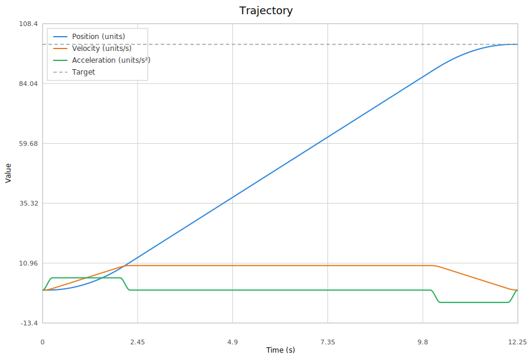
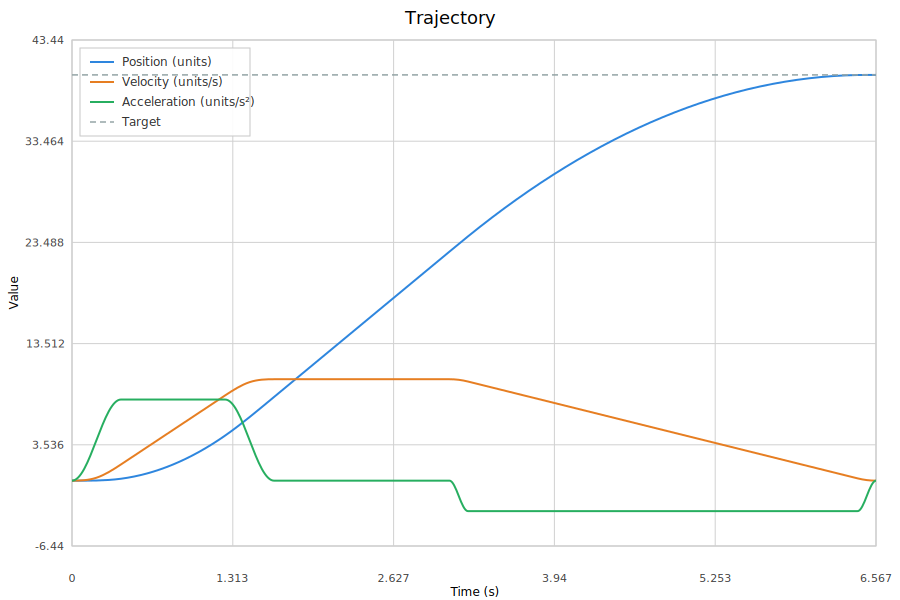
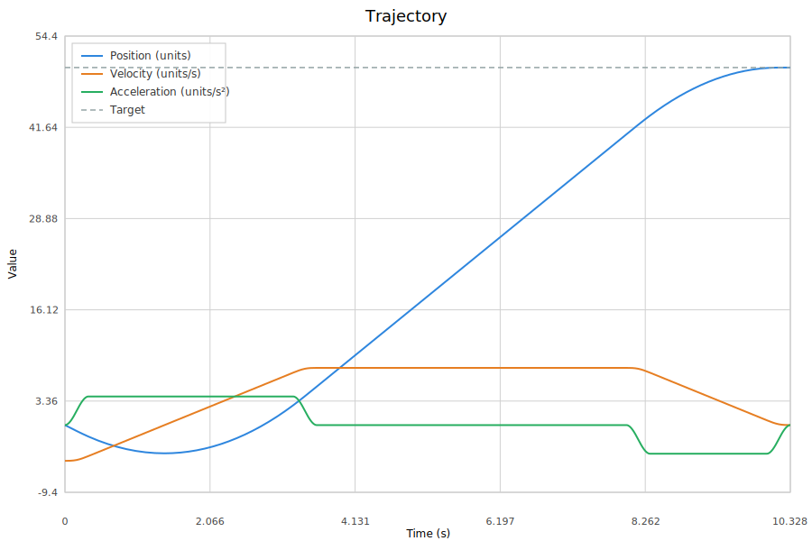

# Chapter 7: Sinusoidal Trajectories

Chapter 6 introduced the piecewise-linear S-curve, which bounds jerk by ramping acceleration linearly between phases. This eliminates the infinite jerk of a trapezoidal profile, but it introduces a subtler problem: the jerk itself is discontinuous. At every phase boundary — the moment acceleration stops ramping and holds constant, or the moment it starts ramping again — the jerk jumps instantaneously from zero to $\pm j_{\max}$ or back. These jerk corners produce small but measurable vibrations in stiff mechanisms.

`SinCurvePosition` replaces the linear ramps with **raised-cosine transitions**, producing acceleration curves that are smooth everywhere. The jerk starts at zero, rises smoothly to a peak, and returns to zero — no discontinuities at any phase boundary. The result is the smoothest trajectory that MarsCommonFtc can generate.

## 7.1 The Raised-Cosine Acceleration Shape

The core idea is simple. Where `SCurvePosition` uses a constant jerk $j$ to ramp acceleration linearly from 0 to $a_{\max}$:

$$a_{\text{linear}}(t') = \frac{a_{\max}}{T} \cdot t' \qquad \text{(linear ramp)}$$

`SinCurvePosition` uses a raised-cosine shape:

$$a_{\text{sin}}(t') = \frac{a_{\max}}{2}\left(1 - \cos\left(\frac{\pi t'}{T}\right)\right) \qquad \text{(onset: } 0 \to a_{\max}\text{)}$$

For the offset (ramping $a_{\max} \to 0$):

$$a_{\text{sin}}(t') = \frac{a_{\max}}{2}\left(1 + \cos\left(\frac{\pi t'}{T}\right)\right) \qquad \text{(offset: } a_{\max} \to 0\text{)}$$

Both shapes take the same time $T = a_{\max} / j_{\max}$ as the linear ramp. The only difference is the *shape* of the transition.



### Unified Formula

The code unifies onset, offset, and constant phases with a single parameterized formula:

$$a(t') = \frac{A}{2}\left(1 + s \cdot \cos\left(\frac{\pi t'}{T}\right)\right)$$

Where $A$ is the signed acceleration amplitude (world frame) and $s$ is the phase sign:

| Phase type | $s$ | Behavior |
|---|---|---|
| Onset ($0 \to A$) | $-1$ | Cosine starts at $+1$, so $a = 0$; at $t' = T$, cosine is $-1$, so $a = A$ |
| Constant ($a = A$) | $0$ | Cosine term vanishes, $a = A/2 \cdot 2 = A$ ... but constant phases use standard kinematics directly |
| Offset ($A \to 0$) | $+1$ | Cosine starts at $+1$, so $a = A$; at $t' = T$, cosine is $-1$, so $a = 0$ |

Integrating once gives velocity:

$$v(t') = v_0 + \frac{A}{2}\left(t' + s \cdot \frac{T}{\pi}\sin\left(\frac{\pi t'}{T}\right)\right)$$

Integrating again gives position:

$$p(t') = p_0 + v_0 t' + \frac{A}{2}\left(\frac{t'^2}{2} + s \cdot \frac{T^2}{\pi^2}\left(1 - \cos\left(\frac{\pi t'}{T}\right)\right)\right)$$

These are the `evalP`, `evalV`, and `evalA` methods in the source:

```java
private static double evalA(double ampl, int sign, double dt, double T) {
    if (sign == 0) return ampl;
    double cosVal = Math.cos(Math.PI * dt / T);
    return (ampl / 2.0) * (1.0 + sign * cosVal);
}

private static double evalV(double vStar, double ampl, int sign, double dt, double T) {
    if (sign == 0) return vStar + ampl * dt;
    double sinVal = Math.sin(Math.PI * dt / T);
    return vStar + (ampl / 2.0) * (dt + sign * T * sinVal / Math.PI);
}
```

For constant phases ($s = 0$), the formulas reduce to standard polynomial kinematics: $a = A$, $v = v_0 + A t$, $p = p_0 + v_0 t + \frac{1}{2} A t^2$.

## 7.2 Why Jerk Is Continuous

Differentiating the acceleration gives the jerk:

$$j(t') = \frac{da}{dt'} = -\frac{A \cdot s \cdot \pi}{2T}\sin\left(\frac{\pi t'}{T}\right)$$

At $t' = 0$: $\sin(0) = 0$, so $j = 0$.
At $t' = T$: $\sin(\pi) = 0$, so $j = 0$.

The jerk is zero at both endpoints of every transition. This means adjacent phases connect with matching jerk — no discontinuity. Compare this to `SCurvePosition`, where the jerk jumps from $\pm j_{\max}$ to $0$ at every phase boundary.

The peak instantaneous jerk occurs at $t' = T/2$:

$$j_{\text{peak}} = \frac{A \cdot \pi}{2T} = \frac{\pi}{2} \cdot j_{\max}$$

This is about 57% higher than the constant jerk $j_{\max}$ of the linear S-curve. But the jerk is brief and symmetric — it ramps up smoothly, peaks, and ramps back down. The *average* jerk over the transition is the same as the linear case (the same velocity change happens in the same time), and the *RMS* jerk is lower because the sinusoidal shape distributes the impulse more evenly.

## 7.3 The 7-Phase Structure

Like `SCurvePosition`, the sinusoidal profile divides a rest-to-rest move into seven phases:

| Phase | Sign | Acceleration | Description |
|---|---|---|---|
| T1 | onset ($-1$) | $0 \to a_{\max,\text{accel}}$ | Sinusoidal ramp up |
| T2 | constant ($0$) | $a_{\max,\text{accel}}$ | Hold max acceleration |
| T3 | offset ($+1$) | $a_{\max,\text{accel}} \to 0$ | Sinusoidal ramp down to cruise |
| T4 | constant ($0$) | $0$ | Cruise at $v_{\text{peak}}$ |
| T5 | onset ($-1$) | $0 \to -a_{\max,\text{decel}}$ | Sinusoidal ramp up deceleration |
| T6 | constant ($0$) | $-a_{\max,\text{decel}}$ | Hold max deceleration |
| T7 | offset ($+1$) | $-a_{\max,\text{decel}} \to 0$ | Sinusoidal ramp down to stop |

The phase durations are computed the same way as the linear S-curve:

$$T_1 = T_3 = \frac{a_{\max,\text{accel}}}{j_{\max}} \qquad T_5 = T_7 = \frac{a_{\max,\text{decel}}}{j_{\max}}$$

The key insight: **transition duration is identical to the linear S-curve**. Both ramp from 0 to $a_{\max}$ in $a_{\max}/j_{\max}$ seconds. Only the *shape* differs.

With asymmetric limits, the acceleration and deceleration halves have different transition widths. The following plot uses `aMaxAccel = 8` and `aMaxDecel = 3` — notice how the acceleration ramps are narrow (fast onset) while the deceleration ramps are wide (slow braking):



### The vPeak Solver

The peak velocity $v_{\text{peak}}$ is found by binary search, just as in `SCurvePosition`. The difference is that the distance computation uses sinusoidal integral constants instead of cubic polynomial formulas.

The `sinHalfDist` method computes the distance covered during the acceleration half (T1 + T2 + T3) of the profile:

```java
static double sinHalfDist(double v0, double vPeak, double aMax, double jMax) {
    double dv = vPeak - v0;
    if (dv <= 0) return 0;
    double vMin = aMax * aMax / jMax;  // triangular threshold
    if (dv >= vMin) {
        // Trapezoidal: onset + constant + offset
        double T1 = aMax / jMax;
        double T2 = (dv - vMin) / aMax;
        double d1 = v0 * T1 + aMax * T1 * T1 * C_ONSET;
        double d2 = v1 * T2 + 0.5 * aMax * T2 * T2;
        double d3 = v2 * T3 + aMax * T3 * T3 * C_OFFSET;
        return d1 + d2 + d3;
    } else {
        // Triangular: onset + offset only
        double aPk = Math.sqrt(dv * jMax);
        ...
    }
}
```

The sinusoidal integral constants appear in the onset and offset distance terms:

$$C_{\text{onset}} = \frac{\pi^2 - 4}{4\pi^2} \approx 0.1487 \qquad C_{\text{offset}} = \frac{\pi^2 + 4}{4\pi^2} \approx 0.3513$$

These replace the $\frac{1}{6}$ factor from the cubic polynomial distance formula of the linear S-curve. They arise from integrating the raised-cosine velocity curve over one full transition:

$$C_{\text{onset}} = \frac{1}{4} - \frac{1}{\pi^2} \qquad C_{\text{offset}} = \frac{1}{4} + \frac{1}{\pi^2}$$

The onset constant is smaller because velocity builds slowly at first (cosine starts flat). The offset constant is larger because velocity is already high and the acceleration holds longer before dropping.

### Triangular vs. Trapezoidal

Like the linear S-curve, short moves produce triangular profiles where $v_{\text{peak}}$ is below $a_{\max}^2 / j_{\max}$. The onset and offset are shorter, with a reduced peak acceleration $a_{\text{peak}} = \sqrt{\Delta v \cdot j_{\max}}$. The constant-acceleration phase (T2) and cruise phase (T4) are both zero.

## 7.4 The General Arc: Arbitrary a-to-a Transitions

The onset and offset formulas handle $0 \to A$ and $A \to 0$ transitions. But several situations require transitioning between two *arbitrary* acceleration levels. `SinCurvePosition` handles this with a **general arc**:

$$a(t') = a_{\text{start}} + \frac{\Delta}{2}\left(1 - \cos\left(\frac{\pi t'}{T}\right)\right)$$

Where $\Delta = a_{\text{end}} - a_{\text{start}}$ and $T = |\Delta| / j_{\max}$.

This is implemented in `evalAgen`:

```java
private static double evalAgen(double aStart, double delta, double dt, double T) {
    double cosVal = Math.cos(Math.PI * dt / T);
    return aStart + (delta / 2.0) * (1.0 - cosVal);
}
```

The general arc is the building block for three important optimizations: the merged a0 prefix, the braking handoff, and the midpoint arc.

## 7.5 Prefix Phases: Non-Zero Initial Conditions

Real mechanisms are rarely at rest when a new trajectory is commanded. `SinCurvePosition` handles non-zero initial conditions with the same two-prefix structure as `SCurvePosition`, but using sinusoidal shapes instead of linear jerk.

### The a0 Prefix

When the initial acceleration $a_0$ is non-zero, a **quarter-cosine** arc brings it smoothly to zero:

$$a(t') = a_0 \cos\left(\frac{\pi t'}{2 T_{\text{pre}}}\right) \qquad T_{\text{pre}} = \frac{|a_0|}{j_{\max}}$$

At $t' = 0$: $a = a_0$. At $t' = T_{\text{pre}}$: $a = 0$. The jerk at $t' = 0$ is zero (cosine derivative is $-\sin$, which is zero at the origin), so the prefix connects smoothly with whatever came before.

Integrating gives velocity and position during the prefix:

$$v(t') = v_0 + a_0 \cdot \frac{2 T_{\text{pre}}}{\pi} \sin\left(\frac{\pi t'}{2 T_{\text{pre}}}\right)$$

$$p(t') = p_0 + v_0 t' + a_0 \cdot \frac{4 T_{\text{pre}}^2}{\pi^2}\left(1 - \cos\left(\frac{\pi t'}{2 T_{\text{pre}}}\right)\right)$$

### The Braking Prefix

If the velocity after the a0 prefix is in the wrong direction (away from the target), a symmetric sinusoidal braking profile brings velocity to zero. The structure mirrors the linear S-curve's braking prefix: three sub-phases (onset, constant, offset), but with sinusoidal transitions:

| Sub-phase | Description |
|---|---|
| Onset | Sinusoidal ramp from $a = 0$ to $a = a_{\text{brake}}$ |
| Constant | Hold $a_{\text{brake}}$ to shed most of the wrong-way velocity |
| Offset | Sinusoidal ramp from $a_{\text{brake}}$ back to $0$ |

The braking amplitude uses the larger of `aMaxAccel` and `aMaxDecel` for fastest braking. If the wrong-way speed is small enough ($|v| < a_{\text{brake}}^2 / j_{\max}$), the braking profile is triangular — onset and offset only, with reduced peak acceleration.

## 7.6 Smart Phase Merging

The raw prefix-then-7-phase structure can produce unnecessary jerk corners where two adjacent sinusoidal transitions meet at $a = 0$. `SinCurvePosition` detects these cases and merges adjacent phases into single general arcs, reducing segment count and improving smoothness.

### Case A: Merged a0 Prefix with Braking Onset

When both the a0 prefix and braking are needed, and the initial acceleration is already pointing in the braking direction, the a0 prefix and braking onset are merged into a single general arc from $a_0$ to $a_{\text{brake}}$:

```
Without merging:   a0 → 0 (prefix) → 0 → aBrake (braking onset)
With Case A:       a0 → aBrake (single arc)
```

The merged arc has duration $T_A = |a_{\text{brake}} - a_0| / j_{\max}$ and uses `evalPgen`/`evalVgen` for evaluation. This eliminates a stop-at-zero-acceleration segment that would waste time and produce unnecessary jerk reversals.

There is a subtlety: the merged arc might overshoot — the combined acceleration could be so large that it brakes the wrong-way velocity completely during the arc itself. In that case, the code reduces the peak to a triangular solution:

$$a_{\text{peak,tri}} = \sqrt{\frac{2 |v_0| \cdot j_{\max} + a_0^2}{2}}$$

This ensures the arc ends with velocity exactly at (or just past) zero, ready for the remainder of the braking prefix.

### Case B: Braking Handoff to Main Acceleration

When braking ends and the main acceleration phase begins in the same direction, the braking offset and T1 onset are replaced by a single **handoff arc**:

```
Without handoff:   aBrake → 0 (braking offset) → 0 → aPkAccel (T1 onset)
With Case B:       aBrake → aPkAccel (single handoff arc)
```

To make this work, the braking prefix is modified: its offset sub-phase is removed (set to zero duration), and the constant sub-phase duration is adjusted so that velocity reaches exactly zero at the new braking endpoint. The handoff arc then transitions smoothly from the braking acceleration to the main acceleration peak.

The handoff arc uses the general arc formula with $a_{\text{start}} = a_{\text{brake}}$ and $a_{\text{end}} = a_{\text{peak,accel}} \cdot \text{dir}$:

```java
double T_h = Math.abs(aHEnd - aHStart) / this.jMax;
double[] handoffEnd = evalPhaseEndGen(pBrk, 0.0, aHStart, aHEnd, T_h);
```

The vPeak binary search is re-run after Case B is detected, using `sinHalfDistCombined` instead of `sinHalfDist` for the acceleration half, since the handoff arc covers different distance than a standard onset.

### Midpoint Arc: No-Cruise Acceleration-to-Deceleration

When the move is too short for a cruise phase ($T_4 = 0$), the T3 offset and T5 onset would normally meet at $a = 0$. `SinCurvePosition` merges them into a single general arc from $a_{\text{peak,accel}}$ to $-a_{\text{peak,decel}}$:

```
Without merging:   aPkAccel → 0 (T3 offset) → 0 → -aPkDecel (T5 onset)
With midpoint:     aPkAccel → -aPkDecel (single arc, stored in T3 slot)
```

The combined arc duration is $(a_{\text{peak,accel}} + a_{\text{peak,decel}}) / j_{\max}$. T5 is set to zero, and the binary search uses `sinFullDistCombinedMid` which forward-chains through T1 → T2 → midpoint arc → T6 → T7.

All three merging optimizations can be active simultaneously. A short-distance direction-reversal move might use Case A (merged prefix), Case B (handoff), and the midpoint arc — reducing the total phase count and eliminating all acceleration corners.

The following plot shows a direction-reversal move with $v_0 = -5$ (wrong-way velocity). The braking prefix brings velocity to zero, the handoff arc transitions smoothly into the main acceleration, and the profile completes with standard deceleration phases:



## 7.7 Distance Computation with Combined Arcs

The binary search for $v_{\text{peak}}$ requires computing the total distance as a function of peak velocity. With phase merging, there are three distance functions:

**`sinHalfDist`** — standard acceleration or deceleration half with onset, constant, and offset phases. Used when no special merging applies.

**`sinHalfDistCombined`** — acceleration half when Case B (handoff) is active. Replaces the normal onset with a handoff arc starting from the braking amplitude.

**`sinFullDistCombinedMid`** — full no-cruise distance with the midpoint arc. Forward-chains through all phases including the combined T3 arc.

**`sinFullDistHandoffAndMid`** — full no-cruise distance with both handoff and midpoint arcs active simultaneously.

Each function is monotonically increasing in $v_{\text{peak}}$, so bisection converges reliably in 64 iterations.

## 7.8 Comparing S-Curve vs. Sinusoidal Profiles

### The Same

- **7-phase structure** — both divide the move into the same logical phases
- **Phase durations** — $T_1 = a_{\max}/j_{\max}$ in both cases
- **vPeak solver** — binary search in both cases
- **Asymmetric limits** — both support independent `aMaxAccel` and `aMaxDecel`
- **Non-zero initial conditions** — both handle $v_0 \neq 0$ and $a_0 \neq 0$ with prefix phases
- **Total move time** — nearly identical for the same limits (within a few percent)
- **API** — both implement `PositionTrajectory` and accept the same constructor arguments

### Different

| Property | `SCurvePosition` | `SinCurvePosition` |
|---|---|---|
| Acceleration shape | Piecewise linear (trapezoidal ramps) | Raised cosine (smooth curves) |
| Jerk | Discontinuous at phase boundaries | Continuous everywhere |
| Peak jerk | $j_{\max}$ (constant during ramps) | $\frac{\pi}{2} j_{\max}$ (brief peak at midpoint) |
| Position formula | Cubic polynomial per phase | Trigonometric per phase |
| Phase merging | None | Case A, Case B, midpoint arc |
| Evaluation cost | Cheaper (polynomials only) | Slightly more expensive (`sin`/`cos` per sample) |
| Distance traveled | Slightly different for same limits | Slightly different for same limits |
| Code complexity | ~400 lines | ~1100 lines |

### Which Should You Use?

**Use `SCurvePosition` (the default) when:**
- You want simplicity and fast evaluation
- Jerk discontinuities are acceptable for your mechanism
- You are building a prototype and want to start simple

**Use `SinCurvePosition` when:**
- You want the smoothest possible motion for a stiff or delicate mechanism
- You are tuning with ControlLab and want to visually verify smooth acceleration curves
- You are combining profiles with mid-motion replanning and want the cleanest possible acceleration trace between replans

In practice, most FTC mechanisms are compliant enough that jerk discontinuities are not a problem. The difference is most visible in ControlLab plots and most audible on rigid geared mechanisms.

## 7.9 Using SinCurvePosition

### Factory Injection

`PositionTrajectoryManager` uses `SCurvePosition` by default. To switch to sinusoidal trajectories, inject `SinCurvePosition::new` as the factory:

```java
PositionTrajectoryManager trajectory = new PositionTrajectoryManager(
    maxVelRad, maxAccelRad, maxDecelRad, maxJerkRad,
    toleranceRad, telemetry, clock,
    SinCurvePosition::new);   // factory injection
```

This works because `SinCurvePosition`'s constructor signature matches `PositionTrajectoryManager.TrajectoryFactory`:

```java
@FunctionalInterface
public interface TrajectoryFactory {
    PositionTrajectory create(
        double p0, double pTarget,
        double v0, double a0,
        double vMax, double aMaxAccel, double aMaxDecel, double jMax);
}
```

No other code changes are needed. The manager creates, samples, and replans sinusoidal trajectories the same way it does linear S-curves.

### Direct Construction

For one-off trajectory evaluation outside a manager:

```java
SinCurvePosition traj = new SinCurvePosition(
    0,      // p0: start position
    100,    // pTarget: target position
    0,      // v0: initial velocity
    0,      // a0: initial acceleration
    5,      // vMax: max velocity
    3,      // aMaxAccel: max acceleration
    3,      // aMaxDecel: max deceleration
    10);    // jMax: max jerk

double tf = traj.getTotalTime();
for (double t = 0; t <= tf; t += 0.01) {
    double p = traj.getPosition(t);
    double v = traj.getVelocity(t);
    double a = traj.getAcceleration(t);
}
```

### Inspecting the Profile Structure

`SinCurvePosition` exposes its phase structure as public fields:

```java
System.out.println("vPeak = " + traj.vPeak);
System.out.println("T1=" + traj.T1 + " T2=" + traj.T2 + " T3=" + traj.T3
    + " T4=" + traj.T4 + " T5=" + traj.T5 + " T6=" + traj.T6 + " T7=" + traj.T7);
System.out.println("a0 prefix = " + traj.tPrefix);
System.out.println("brake prefix = " + traj.tBrake);
System.out.println("handoff = " + traj.handoffCombined);
System.out.println("midpoint = " + traj.midpointCombined);
```

This is useful for debugging and for understanding which optimizations are active for a given move.

### SVG Export with ControlLab

The trajectory visualization tab in ControlLab can render `SinCurvePosition` profiles. The `positionSegments()`, `velocitySegments()`, and `accelerationSegments()` methods return curve segments suitable for SVG export, allowing side-by-side comparison of linear and sinusoidal profiles.

## 7.10 Mid-Motion Replanning

When used through `PositionTrajectoryManager`, sinusoidal trajectories support mid-motion replanning exactly as described in Chapter 6. A new `SinCurvePosition` is seeded from the current position, velocity, and acceleration:

```java
// Manager internally does:
SinCurvePosition newTraj = new SinCurvePosition(
    currentP, newTarget, currentV, currentA,
    vMax, aMaxAccel, aMaxDecel, jMax);
```

Because the new trajectory starts from the current $a_0$, the a0 prefix fires to smoothly bring the inherited acceleration to zero before the main 7-phase profile begins. Position, velocity, and acceleration are continuous across the replan boundary.

**Jerk is not continuous across replans.** The replan creates a new a0 prefix whose jerk at $t = 0$ is zero, but the jerk of the previous trajectory at the replan instant is generally non-zero. This is an inherent limitation — guaranteeing jerk continuity across replans would require solving a boundary-value problem at each replan, which is computationally expensive and rarely needed.

In practice, the jerk discontinuity at a replan boundary is small because the a0 prefix starts gently (the cosine derivative is zero at the origin). Rapid target changes produce visible acceleration nodes, but individual replans are nearly invisible in the acceleration trace.

## 7.11 Summary

`SinCurvePosition` is a drop-in replacement for `SCurvePosition` that eliminates jerk discontinuities at phase boundaries. The key ideas are:

- **Raised-cosine acceleration** — $a(t') = \frac{A}{2}(1 + s \cos(\pi t'/T))$ replaces linear ramps
- **Jerk is zero at phase boundaries** — the sine derivative of cosine is zero at $0$ and $\pi$
- **Peak jerk is $\pi j_{\max}/2$** — about 57% higher than the linear case, but brief and symmetric
- **Same phase durations** — transition times are identical to the linear S-curve
- **General arcs** — handle arbitrary $a_{\text{start}} \to a_{\text{end}}$ transitions for phase merging
- **Three merging optimizations** — Case A (prefix + braking), Case B (braking + T1 handoff), and midpoint (T3 + T5) eliminate unnecessary acceleration corners
- **Factory injection** — `SinCurvePosition::new` plugs into `PositionTrajectoryManager` with no other code changes
- **Replan continuity** — position, velocity, and acceleration are continuous; jerk is not

Chapter 8 introduces online trajectory generation with the Ruckig library, which solves the time-optimal jerk-limited problem in real time for multi-degree-of-freedom systems.
